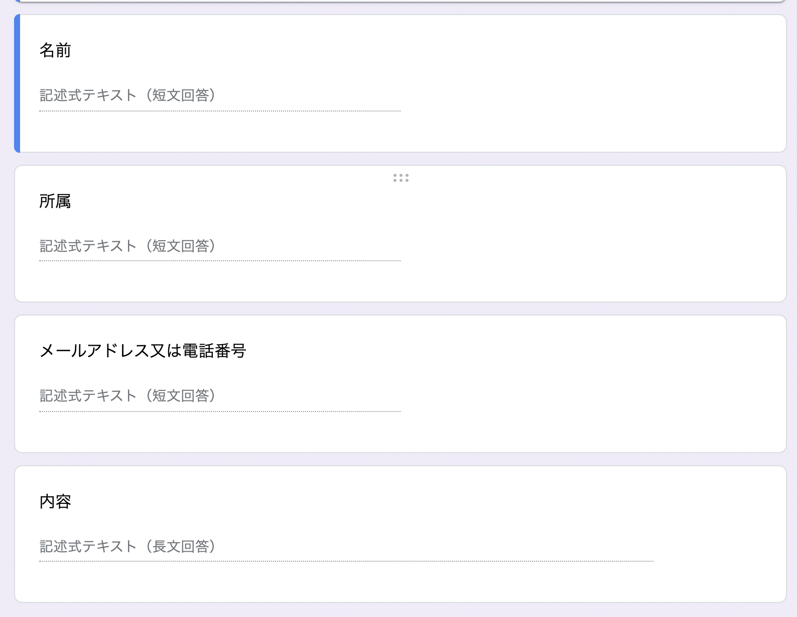
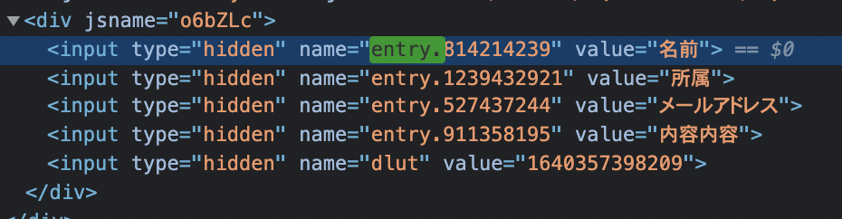

### 目次

```toc

```

このファイルは、 [`src/contents/news/how-to-connect-contact-form.md`](https://github.com/sshihci/sshihci.github.io/blob/develop/src/contents/news/how-to-connect-contact-form.md) に対応しています。

### お問い合わせフォームと Google フォームの連携方法

1. Google フォームを作成します。

   - https://docs.google.com/forms/u/0/
   - 以下の画像のようになれば問題ないです。
     

2. 新しい回答の通知を受け取るようにする

   1. 1 で作成した Google フォームの回答タブをクリックする
   2. スプレッドシートマークの右にある３点マークをクリックする。
   3. 「新しい回答についての通知を受け取る」をクリックしてにチェックをつける

3. お問い合わせ内容をスプレッドシートに同期させる

   1. 1 で作成した Google フォームの回答タブをクリックする
   2. スプレッドシートマークをクリックする
   3. 「新しいスプレッドシートを作成」または、「既存のスプレッドシートを選択」を選び作成をクリックする

4. **難** Google フォームの各項目の ID と URL を確認する

   1. 1 で作成した Google フォームの上部にある「目のボタン(プレビュー）」を押す。
   2. 開いたページの URL を確認します。（後ほど使います。）
   3. 4.2 で開いたフォームに適当な値を入力します。
   4. 開発者ツールを開きます。
      - https://developer.mozilla.org/ja/docs/Learn/Common_questions/What_are_browser_developer_tools ここが参考になります。
   5. 開発者ツールの中の `Inspector` や `Element`, `要素` などといった名前のタブを開きます。
   6. `Inspector` タブを開くと、HTML が表示されます。そのままどこでも良いのでクリックして `Inspector` にフォーカスを当ててください。
   7. `Ctl + F` または `Cmd + F` を押して、 `Inspector` の検索バーを出現させます。
   8. `Inspector` の検索バーに `entry.` と入力してください。すると、この画像のように４件ヒットするはずです。

      - 
      - `value="名前"` などとなっている箇所は 3 番で入力した値に応じて変わります。

   9. 検索結果を元に、フォームの項目とそれに対応する `entry.` で始まる id を確認します。（後で使います。）

5. Google フォームの情報をサイトに反映させる
   1. [`gatsby-config.ts`](https://github.com/sshihci/sshihci.github.io/blob/develop/gatsby-config.ts) を開きます。
   2. 鉛筆マークからこのファイルの編集を選択してください。
   3. およそ 5 ~ 14 行目に既存の Google フォームの設定値があることを確認してください。
   4. そのうち、`googleFormUrl` に 4.2 で確認した URL を貼り付けてください。
   5. `fields` に 4.9 で確認した値を貼り付けます。
      - `name` には名前に対応する `entry.` で始まる id を貼り付けます。
      - `belongs` には所属に対応する `entry.` で始まる id を貼り付けます。
      - `contactAddress` には連絡先に対応する `entry.` で始まる id を貼り付けます。
      - `body` には内容に対応する `entry.` で始まる id を貼り付けます。
   6. クオーテーション(`'`)などを消してしまっていないか確認したら、ページの下部にある緑色の `Commit changes` と書いてあるボタンを押してください。
      - その際に、ボタン上部に 2 つの入力欄とラジオボタンが表示されますが、基本的にそのままで問題ありません
      - 入力欄はどちらも空で問題ありません。
      - ラジオボタンは、「`Commit directly to the develop branch.`」を選択してください

これで設定は終了です。5~10 分ほどすると更新が反映されます。

### 関連リンク

- [お知らせの作成方法](../how-to-create-news)
- [お知らせの更新方法](../how-to-update-news)
- [お知らせの削除方法](../how-to-delete-news)
- [ファイルのアップロード方法](../how-to-upload-file)
- [ファイルの更新方法](../how-to-upload-file)
- [ファイルの削除方法](../how-to-delete-file)
- [サイトの更新状態の確認方法](../how-to-check-deploy)
- [秘密情報をアップロードしてしまったら](../how-to-remove-from-git-history)
